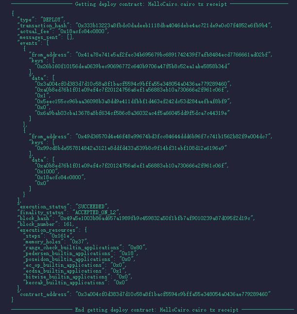
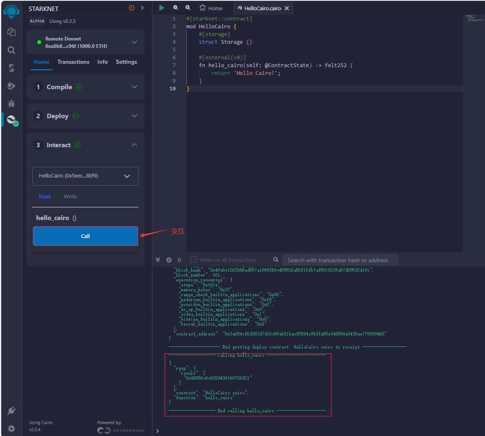

# WTF Cairo极简教程: 1. Hello Cairo

我最近在学`cairo-lang`，巩固一下细节，也写一个`WTF Cairo极简教程`，供小白们使用。教程基于`cairo 2.2.0`版本。

推特：[@0xAA_Science](https://twitter.com/0xAA_Science)｜[@WTFAcademy_](https://twitter.com/WTFAcademy_)

WTF Academy 社群：[Discord](https://discord.gg/5akcruXrsk)｜[微信群](https://docs.google.com/forms/d/e/1FAIpQLSe4KGT8Sh6sJ7hedQRuIYirOoZK_85miz3dw7vA1-YjodgJ-A/viewform?usp=sf_link)｜[官网 wtf.academy](https://wtf.academy)

所有代码和教程开源在 github: [github.com/WTFAcademy/WTF-Cairo](https://github.com/WTFAcademy/WTF-Cairo)

---

## Cairo 简介

`Cairo` 是以太坊ZK-Rollup扩容方案 Starknet 上智能合约的编程语言。它也用于编写可证明程序。Cairo主要有两个特点：

1. ZK友好: `Cairo`是图灵完备的通用可证明计算的编程语言，可以编译为 Stark 可证明程序。

2. 难学: `Cairo` 学习曲线陡峭；并且现在属于开发早期，每个版本都会有很大改变。

目前 `Cairo` 版本为 `2.2.0`，基于 Rust，所以语法也很像 Rust，与之前的 `0.x` 版本有很大不同。学习 Rust 对学习 Cairo 有很大帮助，Rust中文资料汇总见[链接](https://github.com/WTFAcademy/WTF-Rust)。

## 开发工具

由于目前`Cairo`仍处于早期，工具还在开发中，并未成熟。我们可以选择使用本地工具[scarb](https://github.com/software-mansion/scarb)或者在线工具[Starknet Remix](https://remix.ethereum.org/)来编译合约。

### 使用 Scarb

为了使用`scarb`，我们需要安装`rust`和`scarb`。

1. 下载 [Rust](https://www.rust-lang.org/tools/install)

2. 安装 Rust:

    ```shell
    rustup override set stable && rustup update
    ```

3. 确认 Rust 被正确安装:
    
    ```shell
    cargo test
    ```
    
    确认Cagro被正确安装：
    
    ```shell
    cargo new project
    cd project
    cargo test
    ```

5. 安装scarb，你可以阅读[安装文档](https://docs.swmansion.com/scarb/download.html#precompiled-packages)

   如果你使用的系统是`Linux`或`Mac`，可以用下面的命令行安装
   
    ```shell
    curl --proto '=https' --tlsv1.2 -sSf https://docs.swmansion.com/scarb/install.sh | sh
    ```

   如果你使用的系统是`Windows`，需要进行手动安装。下载对应的安装包，并将`bin`目录添加到环境变量`Path`中

   验证scarb被成功安装

    ```shell
    scarb --version
    ```

7. 创建新项目项目（project和directory可以自定义）:

    ```shell
    scarb new project/directory
    ```

8. 编译合约：

    ```shell
    scarb build
    ```

9. 如果要构建CASM，需要在`Scarb.toml`中添加:

    ```
    [lib]
    casm = true
    ```

10. 如果要编译Starknet合约，需要在`Scarb.toml`中添加:

    ```
  [dependencies] 
  starknet = ">=2.6.0" 

  [[target.starknet-contract]]
  
    ```

更多Scarb用法见[官网文档](https://docs.swmansion.com/scarb/docs.html)。

## 编译并部署运行

1. 创建新项目：在你想存储代码的任何位置，执行以下命令：

    ```
    scarb new hello_scarb
    cd hello_scarb
    ```
   
    在这个项目中有两个文件和一个目录：一个Scarb.toml文件、包含lib.cairo文件的src目录和一个.gitignore文件。同时会初始化一个新的Git存储库。

2. 对于lib.cairo文件。让我们清空其内容，并添加以下一行代码：

    ```
    mod hello_scarb;
    ```

    声明引用了"hello_scarb"的模块。

3. 在src目录下创建一个名为hello_scarb.cairo的新文件，实现"hello_scarb"模块的细节。

    ```
    fn main() {
        println!("Hello, World!");
    }
    ```

4. 构建项目：在hello_scarb目录中，输入以下命令构建项目:

    ```
    $ scarb build
      Compiling hello_scarb v0.1.0 (D:\hello_scarb\Scarb.toml)
        Finished release target(s) in 1 second
    ```

    这个操作会生成一个名为target的目录以及一个Scarb.lock的文件，让我们先忽略他们

5. 输出结果:在hello_scarb目录中，输入以下命令:

    ```
    $ scarb cairo-run
      Compiling hello_scarb v0.1.0 (D:\hello_scarb\Scarb.toml)
        Finished release target(s) in 1 second
         Running hello_scarb
    Hello, World!
    Run completed successfully, returning []
    ```

### 使用 Starknet Remix

1. 进入Remix官网: [remix.ethereum.org](https://remix.ethereum.org)

2. 进入扩展市场，搜索`Starknet`，安装它。


## Starknet合约 `Hello Cairo`

`Starknet`合约与`Cairo`程序最大的不同之处在于，Cairo程序必须有`fn main(){}`作为程序的入口点，部署在 `Starknet` 网络上的合约本质上是由定序器运行的程序，因此可以访问 `Starknet` 的状态。合约没有`main`函数，只有一个或多个函数可以作为入口点。并且`Starknet`合约可以访问和修改`Starknet`状态。

下面，我们来写第一个`Starknet`合约：`HelloCairo.cairo`。

```rust
#[starknet::contract]
mod HelloCairo {
    #[storage]
    struct Storage {}

    #[external(v0)]
    fn hello_cairo(self: @ContractState) -> felt252 {
        return 'Hello Cairo!';
    }
}
```

我们拆开分析，学习cairo合约源文件的结构：

第1行利用 `#[starknet::contract]` 声明了这段代码为 `Starknet` 合约。如果不声明，则不能部署在 `Starknet` 上。

```rust
#[starknet::contract]
```

第2行利用 `mod` 模块关键字创建了合约，名为 `HelloCairo`。这与 `Rust` 中的 `mod` 类似，是一系列元素的集合，包括结构体、函数等。

```rust
mod HelloCairo {
}
```

第3-4行，我们声明了合约的状态变量。在Cairo中，即使合约没有状态变量，也需要声明。

```rust
    #[storage]
    struct Storage {}
```

之后，我们写了一个函数 `hello_cairo`。第6行，我们用 `#[external(v0)]` 属性修饰这个函数。与`solidity`中的类似`external`类似，该函数可以被外部调用。

```rust
#[external(v0)]
```

第7-9行我们声明了 `hello_cairo` 函数。它只有一个参数`self: @ContractState`，表示它是`view`函数。它有一个返回值，类型为`felt252`：`felt`（field element，域元素）是 `cairo` 的基本类型之一，我们会在之后的章节更详细的介绍它。在函数体中，我们将返回值设为用`felt252`表示的短字符串（长度小于32个字符） `Hello Cairo!`。

```rust
  fn hello_cairo(self: @ContractState) -> felt252 {
      return 'Hello Cairo!';
  }
```

## 使用 Starknet Remix 部署合约

1. 选择`HelloCairo.cairo`合约，点击编译键（Compile）进行编译。


2. 宣称(declare)该合约



3. 部署合约。


   
3. 进行交互，请求'hello_cairo'函数。



## 总结

这一讲，我们简单介绍了`Cairo`语言，并编译了第一个`Cairo`智能合约--`Hello Cairo`。之后，我们将继续 `Cairo` 之旅！

## Cairo 资料参考

1. [Cairo Book](https://book.cairo-lang.org/)
2. [Cairo官方文档（英文）](https://www.cairo-lang.org/docs/v1.0/)
3. [Starkling Cairo1](https://github.com/shramee/starklings-cairo1)
4. [Starknet Cairo 101](https://github.com/starknet-edu/starknet-cairo-101)
5. [Starknet by Example(中文)](https://github.com/NethermindEth/StarknetByExample)
