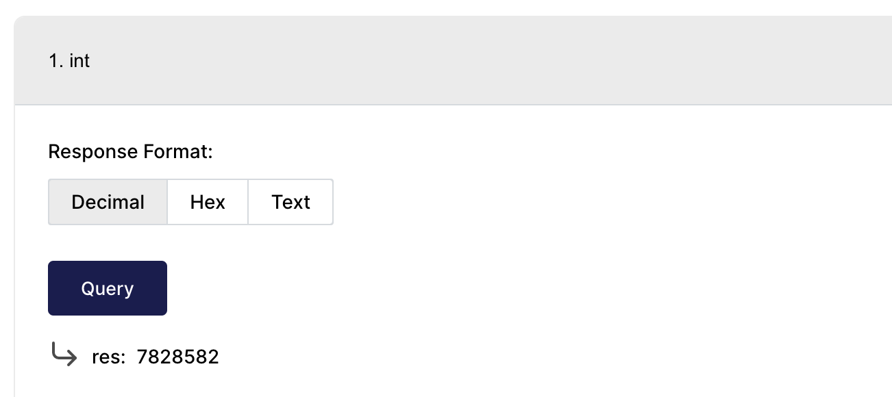
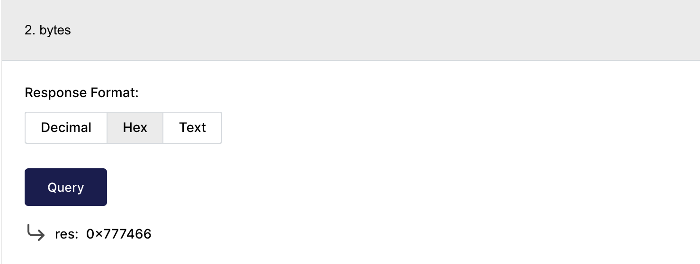
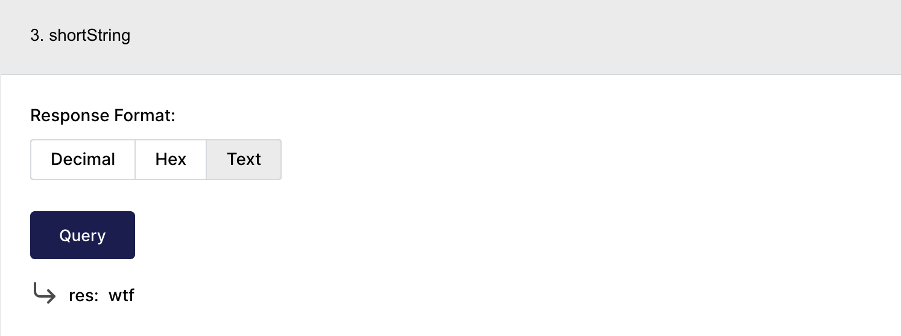
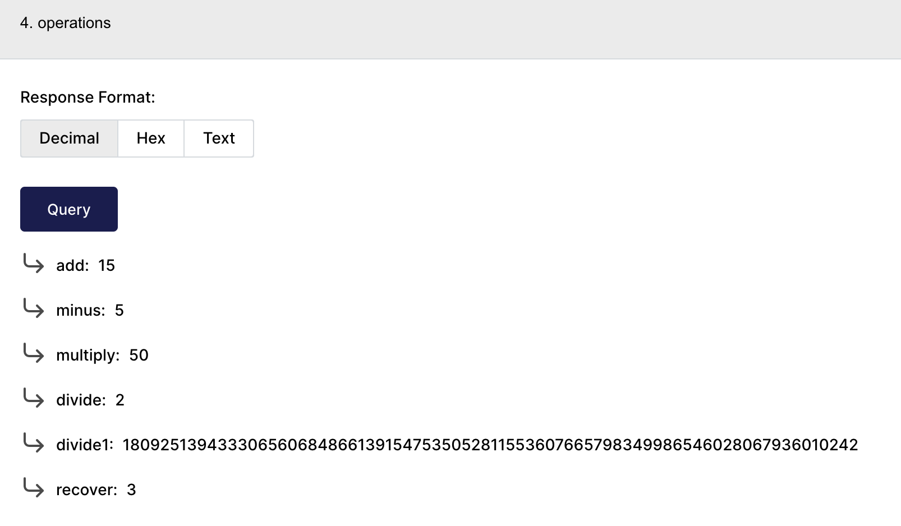

# WTF Cairo极简教程: 2. 基本类型 Felt

我最近在学`cairo-lang`，巩固一下细节，也写一个`WTF Cairo极简教程`，供小白们使用。教程基于`cairo 0.10.2`版本

推特：[@0xAA_Science](https://twitter.com/0xAA_Science)｜[@WTFAcademy_](https://twitter.com/WTFAcademy_)

WTF Academy 社群：[Discord](https://discord.wtf.academy)｜[微信群](https://docs.google.com/forms/d/e/1FAIpQLSe4KGT8Sh6sJ7hedQRuIYirOoZK_85miz3dw7vA1-YjodgJ-A/viewform?usp=sf_link)｜[官网 wtf.academy](https://wtf.academy)

所有代码和教程开源在 github: [github.com/WTFAcademy/WTF-Cairo](https://github.com/WTFAcademy/WTF-Cairo)

---

## `felt`

`felt`（[field](https://en.wikipedia.org/wiki/Field_(mathematics)) element，域元素）是 `cairo` 的基本类型，数字，字符串，地址通通由它表示。它是定义在 $[0, P]$ 的整数，其中 `P` 是一个非常大的质数。在目前的版本中，$P = 2^{251}+17*2^{192}+1$，大小为`252 bit`。`P` 具有一些很好的数学性质用于零知识证明，因此没有选择和`Solidity`一致的`256 bit`。

## 整型

`felt` 可以被整型赋值，下面的例子中，我们将 `7828582` 赋值给 `res`:

```python
@view
func int() -> (res: felt) {
    return (res=7828582);
}
```



## 字节

`felt` 可以被 `bytes`（十六进制数）赋值，下面的例子中，我们将 `0x777466` 赋值给 `res`:

```python
@view
func bytes() -> (res: felt) {
    return (res=0x777466);
}
```


## 短字符串

`felt` 可以被短字符串（31个字符以内）赋值，太长的字符串需要借助外部的库（cairo-lang 1.0 版本可能会改善）。下面的例子中，我们将 `wtf` 赋值给 `res`:

```python
@view
func shortString() -> (res: felt) {
    return (res='wtf');
}
```



上面三个变量 `7828582`，`0x777466`，和 `'wtf'` 对应的`felt`值其实是相等的，你可以将合约部署到测试网，然后在区块链浏览器的`Read Contract`页面分别点击`Decimal`，`Hex`，和`Text`看看同一个值的不同格式输出。

## 布尔值

如果你需要使用布尔值，将`felt`赋值为`0`或`1`。

## 运算符

`felt` 类型支持加，减，乘，除四则运算，但是除法与整数除法有区别。

1. 如果`x` 能被 `y` 整除，那么非常好，结果也是整数。下面的例子中，变量 `divide` = `10/5` = `2`。

2. 如果 `x` 不能被 `y` 整除，比如 `3/2`，那么很不好，结果既不是 `1`，`2`，或 `1.5`。而是：
    ```
    1809251394333065606848661391547535052811553607665798349986546028067936010242
    ```
    是的，非常长的一串数字，为了方便，咱们称这个数字为 $x$，那么 $x$ 代表什么？首先，`felt` 除法是乘法的逆运算，其实 $x = (P+3)/2$，满足$x$为整数且$2 * x (\mod P) = 3$。

在下面的代码中，我们尝试了`felt`的四则运算，其中 `divide1` 变量存储了$x$的值。在 [playground](https://www.cairo-lang.org/playground/) 编译并部署到[测试网](https://goerli.voyager.online/contract/0x104e533249075e50ebb4e24c427c4229ac79a956a075e88e2fd6bd15ad701b2#readContract)之后，我们可以看到 `recover = divide1 * 2 = 3`。

```python
@view
func operations() -> (add: felt, minus: felt, multiply: felt, divide: felt, divide1: felt, recover: felt) {
    let x = 10;
    let y = 5;
    let add = x + y;
    let minus = x - y;
    let multiply = x * y;
    let divide = x/y;
    // note the division of felt is different from integers.
    let divide1 = 3/2;
    let recover = divide1*2;
    return (add, minus, multiply, divide, divide1, recover);
}
```



## 总结

这一讲，我们介绍了`cairo`的基本类型`felt`，和它支持的运算符。特别要注意的是`felt`的除法与整数除法不同，可能会得到预期之外的结果。如果想进行整数运算，可以利用[math库](https://github.com/starkware-libs/cairo-lang/blob/master/src/starkware/cairo/common/math.cairo)的`unsigned_div_rem()`函数。