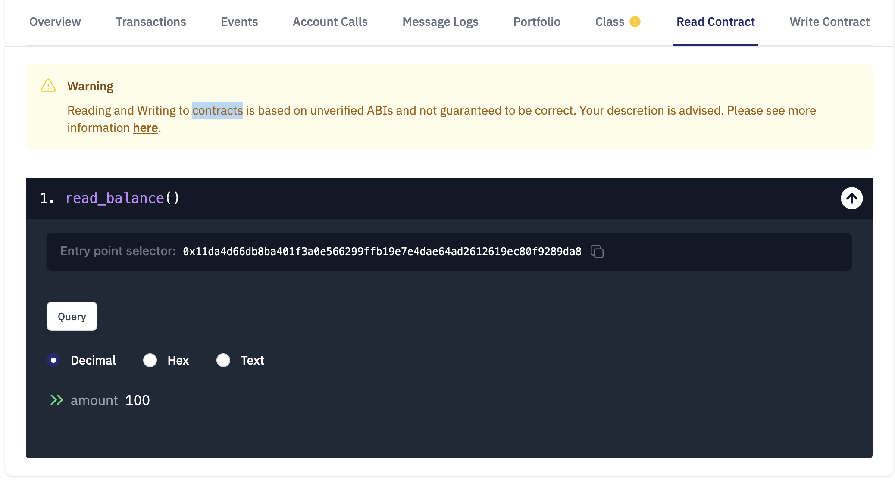

# WTF Cairo极简教程: 3. 函数 func

我最近在学`cairo-lang`，巩固一下细节，也写一个`WTF Cairo极简教程`，供小白们使用。教程基于`cairo 0.10.2`版本

推特：[@0xAA_Science](https://twitter.com/0xAA_Science)｜[@WTFAcademy_](https://twitter.com/WTFAcademy_)

WTF Academy 社群：[Discord](https://discord.wtf.academy)｜[微信群](https://docs.google.com/forms/d/e/1FAIpQLSe4KGT8Sh6sJ7hedQRuIYirOoZK_85miz3dw7vA1-YjodgJ-A/viewform?usp=sf_link)｜[官网 wtf.academy](https://wtf.academy)

所有代码和教程开源在 github: [github.com/WTFAcademy/WTF-Cairo](https://github.com/WTFAcademy/WTF-Cairo)

---

## 函数

首先，我们先看一下 `cairo` 中函数的形式：
```python
@storage_var|external|view
func <function_name>{implicit_parameters}(parameters) -> (return_values){
    function_body;
}
```

看着些复杂，咱们将它分解一下：

1. `@storage_var|external|view`: 函数可见性说明符，目前有以下几种:
    - `storage_var`：状态变量。和solidity不同，cairo合约的状态变量也用函数声明。下面代码声明了一个`felt`类型的名为`balance`变量，它有两个成员函数`read()`和`write()`，用于读取和写入变量。
    ```python
    // 定义余额变量，类型：felt.
    @storage_var
    func balance() -> (res: felt) {
    }
    ```

    - `external`：与solidity的`external`类似，StarkNet 的用户和其他合约可调用`external`函数。下面的代码声明了一个`set_balance()`函数来改变状态变量`balance`的值，它利用了`balance`变量的成员函数`.write()`。
    ```python
    // 设置余额balance.
    @external
    func set_balance{
        syscall_ptr: felt*,
        pedersen_ptr: HashBuiltin*,
        range_check_ptr,
    }(amount: felt) {
        balance.write(amount);
        return ();
    }
    ```

    - `view`：和solidity的`view`类似，与`external`唯一的区别是该函数仅可查询状态，但不能修改状态。下面的代码声明了一个`read_balance()`函数来查询状态变量`balance`的值，它利用了`balance`变量的成员函数`.read()`。
    ```python
    // 读取余额balance.
    @view
    func read_balance{
        syscall_ptr: felt*,
        pedersen_ptr: HashBuiltin*,
        range_check_ptr,
    }() -> (amount: felt) {
        let (res) = balance.read();
        return (amount=res);
    }
    ```

2. `func`：声明函数时的固定用法，函数以`func`关键字开头。

3. `<function name>`：函数名。

4. `{implicit_parameters}`：隐式参数是cairo中的语法糖，会自动添加为函数调用的参数和返回值；如果不需要隐式参数，则可以省略它。查询或写入状态变量需要用到`syscall_ptr`，`pedersen_ptr`，`range_check_ptr`三个隐式参数。它可能会在`cairo 1.0`版本有改动，因此我们先不介绍它。

5.  `(parameters)`：函数的参数。
6. `-> (return_values)`：函数返回的变量类型和名称。
7. `function_body;`：函数主体，每条指令以分号 `;` 结尾。

## 内置函数

`cairo`提供了很多预定义的优化过的函数，方便开发者使用。内置函数类似solidity中的全局变量，包含范围检查、哈希、ECDSA 等，但是使用他们的时候需要导入。在下面的代码中，我们从`cairo_builtins`导入了`HashBuiltin`类型。

```python
from starkware.cairo.common.cairo_builtins import HashBuiltin
```

更多常用的内置函数见[链接](https://github.com/starkware-libs/cairo-lang/tree/master/src/starkware/cairo/common)。

## 代码演示

1. 将合约`Function.cairo`部署到starknet的goerli测试网中，推荐使用Argent X部署，教程见[链接](https://www.argent.xyz/blog/understanding-the-universal-deployer-contract/)。这里有一份部署好的，大家可以用来交互，[链接](https://testnet.starkscan.co/contract/0x0352654644b53b008b9fd565846cca116c0911d0eeabb57df00b55ed77ad211e)。

2. 进入区块链浏览器中合约的`Write Contract`页面，调用`set_balance()`函数，将余额改为`100`。


3. 合约的`Read Contract`页面，调用`read_balance()`函数，读取余额。


## 总结

这一讲，我们介绍了Cairo中的函数类型和内置函数。你可以利用`storage_var`定义合约的状态变量，或利用`view`和`external`声明只读和可读写的函数。
