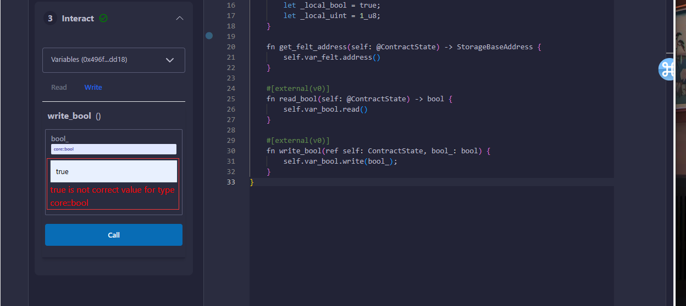
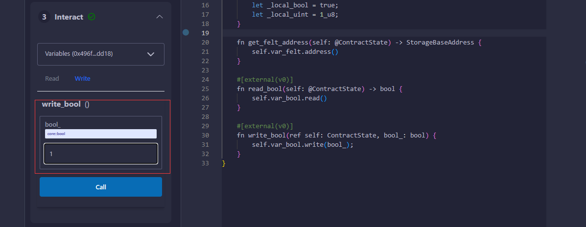

# WTF Cairo极简教程: 3. 局部和状态变量

我最近在学`cairo-lang`，巩固一下细节，也写一个`WTF Cairo极简教程`，供小白们使用。教程基于`cairo 2.2.0`版本。

推特：[@0xAA_Science](https://twitter.com/0xAA_Science)｜[@WTFAcademy_](https://twitter.com/WTFAcademy_)

WTF Academy 社群：[Discord](https://discord.gg/5akcruXrsk)｜[微信群](https://docs.google.com/forms/d/e/1FAIpQLSe4KGT8Sh6sJ7hedQRuIYirOoZK_85miz3dw7vA1-YjodgJ-A/viewform?usp=sf_link)｜[官网 wtf.academy](https://wtf.academy)

所有代码和教程开源在 github: [github.com/WTFAcademy/WTF-Cairo](https://github.com/WTFAcademy/WTF-Cairo)

---

在本章中，我们将介绍Cairo中的两种变量类型：局部变量`local`和状态变量`storage`。

## 局部变量（Local Variables）

`local` 变量在函数内声明。它们是临时的，不会存储在链上。

```rust
// local 变量
#[external(v0)]
fn local_var(self: @ContractState){
    // use `let` keywods to declare local variables 
    let local_felt: felt252 = 5;
    let local_bool = true;
    let local_uint = 1_u8;
}
```

## 状态变量（Storage Variables）

与Solidity类似，Cairo支持合约状态变量。它们会被记录在链上,并且可以被访问和修改。状态变量被存储在名为`Storage`的结构中，必须用`#[storage]`属性进行标注，每个合约最多可以有一个 `Storage` 结构。

存储变量的地址是变量名称的ASCII编码的[sn_keccak](https://docs.starknet.io/documentation/architecture_and_concepts/Cryptography/hash-functions/)哈希值。sn_keccak是Starknet版本的Keccak256哈希函数，其输出被截断为前250位。

```rust
// 声明存储变量
#[storage]
struct Storage{
    var_felt: felt252,
    var_bool: bool,
    var_uint: u8,
}
```

storage结构体中的变量还可以是自定义的结构体或映射，在我们学到时会进一步讲。

## 状态变量的函数

存储变量有三个函数：`address()`、`read()` 和 `write()`，这些函数会由编译器为每个存储变量自动生成。

你可以使用`address`函数可以来获得该状态变量的存储地址，其返回值为StorageBaseAddress类型，需要进行额外导入才可以使用。

```rust
fn get_felt_address(self: @ContractState) -> StorageBaseAddress {
    self.var_felt.address()
}
```

值得注意的是，该函数无法被定义为外部函数，无法直接通过remix的函数接口进行交互。

你可以使用`read`函数来读取状态变量，使用`write`函数来修改状态变量。

注意：这里的`self: @ContractState`代表该函数只允许读取合约的状态，但不可以更改合约的状态，`ref self: ContractState`代表该函数允许修改合约的状态。

```rust
// 读取存储变量
#[external(v0)]
fn read_bool(self: @ContractState) -> bool {
    return self.var_bool.read();
}

// 写入存储变量
#[external(v0)]
fn write_bool(ref self: ContractState, bool_: bool) {
    self.var_bool.write(bool_);
}
```

需要注意的是，在remix中与合约交互时，bool类型不能填写true和false，只能填写1和0。






## 总结

在本章中，我们介绍了Cairo中的`local`和`storage`变量。
