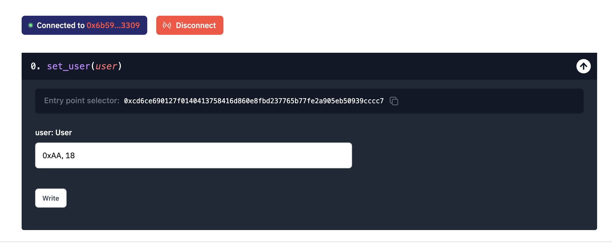
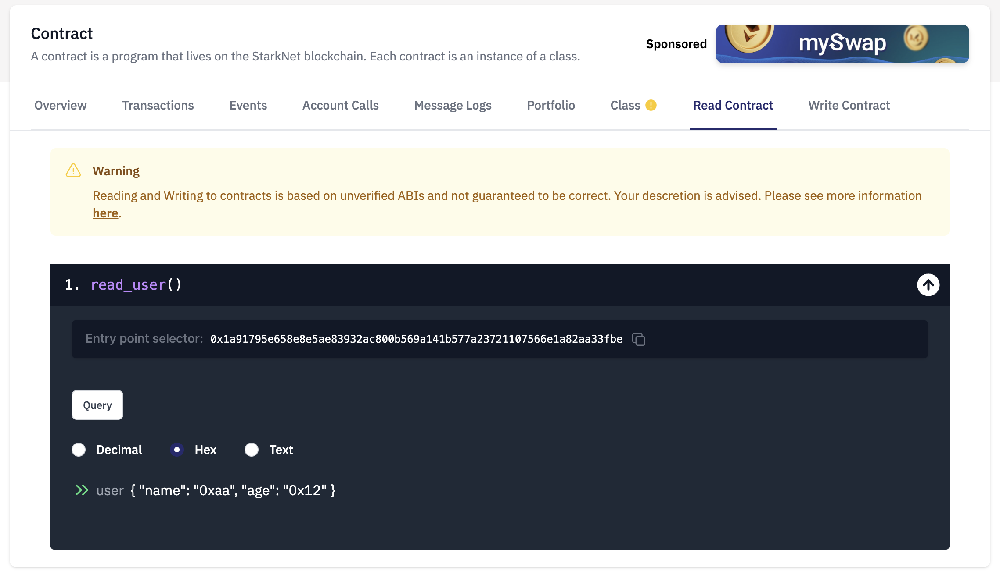

# WTF Cairo极简教程: 4. 结构体

我最近在学`cairo-lang`，巩固一下细节，也写一个`WTF Cairo极简教程`，供小白们使用。教程基于`cairo 0.10.3`版本

推特：[@0xAA_Science](https://twitter.com/0xAA_Science)｜[@WTFAcademy_](https://twitter.com/WTFAcademy_)

WTF Academy 社群：[Discord](https://discord.wtf.academy)｜[微信群](https://docs.google.com/forms/d/e/1FAIpQLSe4KGT8Sh6sJ7hedQRuIYirOoZK_85miz3dw7vA1-YjodgJ-A/viewform?usp=sf_link)｜[官网 wtf.academy](https://wtf.academy)

所有代码和教程开源在 github: [github.com/WTFAcademy/WTF-Cairo](https://github.com/WTFAcademy/WTF-Cairo)

---

这一讲，我们将介绍 Cairo 中的一个重要的变量类型：结构体（struct）。

## 结构体

与 Solidity 一样，Cairo 支持通过构造结构体的形式定义新的类型。创建结构体的方法：

```python
struct User {
    name: felt,
    age: felt,
}
```

### 状态变量

Struct 可以用于状态变量：

```python
// 定义状态变量 new_user，类型：User.
@storage_var
func new_user() -> (user: User){
}
```

我们可以通过状态变量的 `write()` 和 `read()` 函数对 `new_user` 进行写入和读取。

- `set_user()`: 将 `User` 结构体作为参数传入函数，并更新状态变量 `new_user`。

- `read_user()`: 读取状态变量 `new_user`的值并返回。

```python
// 设置 user 信息
@external
func set_user{
    syscall_ptr: felt*,
    pedersen_ptr: HashBuiltin*,
    range_check_ptr,
}(user: User) {
    new_user.write(user);
    return ();
}

// 读取 user 信息
@view
func read_user{
    syscall_ptr: felt*,
    pedersen_ptr: HashBuiltin*,
    range_check_ptr,
}() -> (user: User) {
    let (res) = new_user.read();
    return (user=res);
}
```

## 代码演示

1. 将合约 `Struct.cairo` 部署到starknet goerli测试网中，推荐使用Argent X部署，教程见[链接](https://www.argent.xyz/blog/understanding-the-universal-deployer-contract/)。我们部署好了一份，大家可以直接交互，[链接](https://testnet.starkscan.co/contract/0x04d11b9ecf86e17fdd3e4ad80a63da58cec9c2eff68c2e78819a820bec9b8bc9)。

2. 进入区块链浏览器中合约的`Write Contract`页面，调用`set_user()`函数，将 `new_user` 设为 `0xAA, 18`。


3. 合约的`Read Contract`页面，调用`read_user()`函数，读取用户信息。以 `Hex` （16进制）显示结果为 `0xaa, 0x12`。


## 总结

这一讲，我们介绍了 Cairo中结构体（struct）的基本用法。

