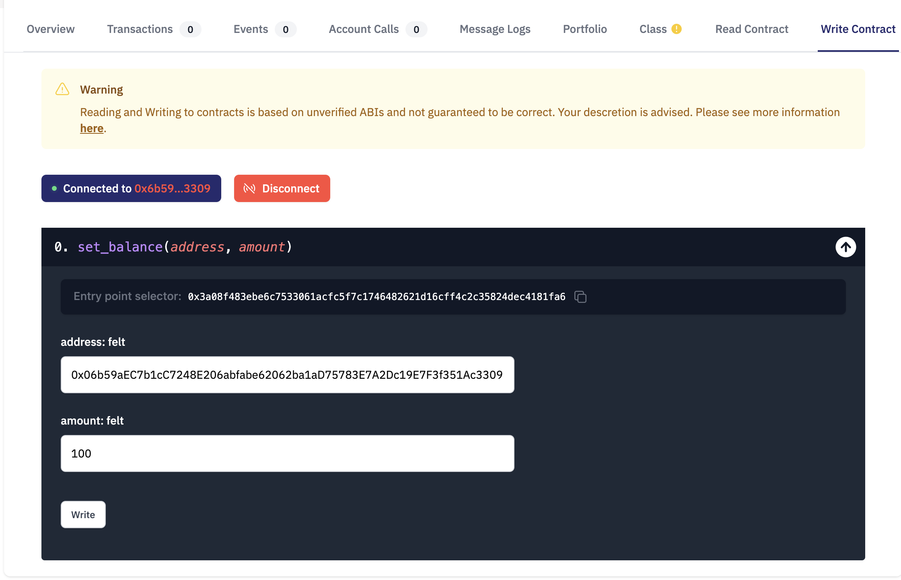
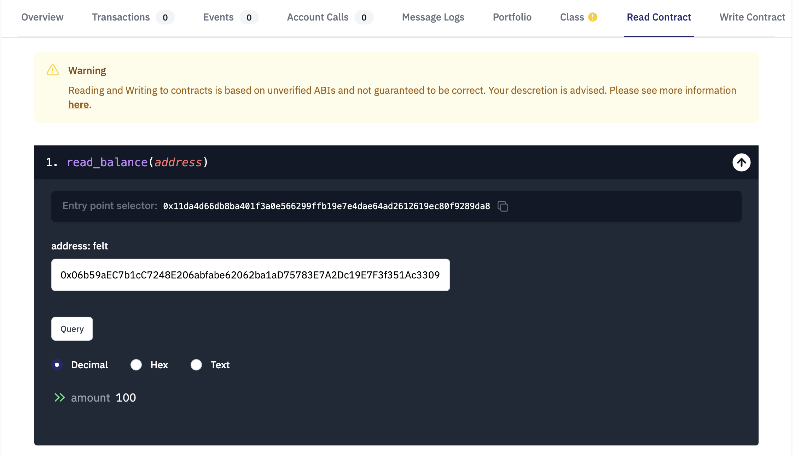

# WTF Cairo极简教程: 5. 映射

我最近在学`cairo-lang`，巩固一下细节，也写一个`WTF Cairo极简教程`，供小白们使用。教程基于`cairo 0.10.3`版本

推特：[@0xAA_Science](https://twitter.com/0xAA_Science)｜[@WTFAcademy_](https://twitter.com/WTFAcademy_)

WTF Academy 社群：[Discord](https://discord.wtf.academy)｜[微信群](https://docs.google.com/forms/d/e/1FAIpQLSe4KGT8Sh6sJ7hedQRuIYirOoZK_85miz3dw7vA1-YjodgJ-A/viewform?usp=sf_link)｜[官网 wtf.academy](https://wtf.academy)

所有代码和教程开源在 github: [github.com/WTFAcademy/WTF-Cairo](https://github.com/WTFAcademy/WTF-Cairo)

---

这一讲，我们将介绍一个常用的数据类型：映射（map）。

## 映射

在映射中，人们可以通过键（`Key`）来查询对应的值（`Value`），比如：通过一个人的地址来查询他的钱包地址。

声明映射的方式与声明 `felt` 类型的状态变量类似，您必须定义映射的类型，并在 `Key` 和 `Value` 之间使用 `->` 符号。在下面的例子中，我们定义了一个 `balance` 映射，`Key` 和 `Value` 的类型均为 `felt`：
```python
@storage_var
func balance(address : felt) -> (amount : felt){
}
```  

`Cairo` 映射的规则与 `Solidity` 有一些不同：
1. `Key` 的类型不仅可以是基本类型 `felt`，也可以是自定义的结构体或元组（包含多个变量）。

2. `Value` 可以是单个 `felt`，结构体，也可以是元组（包含多个变量）。

下面，我们定义了一个 `get_weight_height` 映射变量，它的 `Key` 类型为 `User` 结构体，`Value` 类型为 `[felt, felt]` 元组（体重和身高）。

```python
struct User {
    name: felt,
    age: felt,
}

@storage_var
func get_weight_height(user: User) -> (weight_height: (felt, felt)) {
}
```

### 写入和读取

我们可以通过状态变量的 `write()` 和 `read()` 函数对 `balance` 映射进行写入和读取。

- `set_balance()`: 将地址`address`和余额`amount`作为参数传入函数，并更新地址对应的余额。

- `read_balance()`: 读取给定地址的余额并返回。

```solidity
@external
func set_balance{
    syscall_ptr: felt*,
    pedersen_ptr: HashBuiltin*,
    range_check_ptr,
}(address: felt, amount: felt) {
    balance.write(address, amount);
    return ();
}

@view
func read_balance{
    syscall_ptr: felt*,
    pedersen_ptr: HashBuiltin*,
    range_check_ptr,
}(address: felt) -> (amount: felt){
    let (res) = balance.read(address = address);
    return (amount=res);
}
```

## 代码演示

1. 将合约 `Map.cairo` 编译并部署到StarkNet Goerli测试网中，推荐使用Argent X部署，教程见[链接](https://www.argent.xyz/blog/understanding-the-universal-deployer-contract/)。我们部署好了一份，大家可以直接交互，[链接](https://testnet.starkscan.co/contract/0x03c915d2882ecfaf25500cad780993feca1d649792e5750e638cd5911bafc5da)。

2. 进入区块链浏览器中合约的`Write Contract`页面，调用`set_balance()`函数，参数填：
    ```solidity
    address: 0x06b59aEC7b1cC7248E206abfabe62062ba1aD75783E7A2Dc19E7F3f351Ac3309
    amount: 100
    ```
    

3. 合约的`Read Contract`页面，调用`read_balance()`函数，读取账户的余额，参数填上一步的地址。
    

## 总结

这一讲，我们介绍了 Cairo中映射（map）的基本用法，并写了一个记录账户余额的合约。

