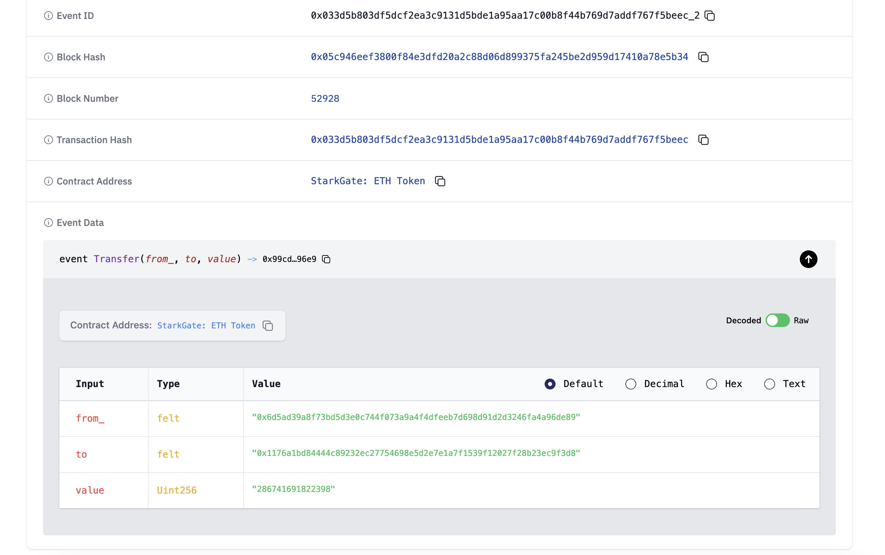

# WTF Cairo: 16. Events

We are learning `Cairo`, and writing `WTF Cairo Tutorials` for Starknet newbies. The tutorials are based on `Cairo 1.0`.

Twitter: [@0xAA_Science](https://twitter.com/0xAA_Science)｜[@WTFAcademy_](https://twitter.com/WTFAcademy_)

WTF Academy Community：[Discord](https://discord.gg/5akcruXrsk)｜[Wechat](https://docs.google.com/forms/d/e/1FAIpQLSe4KGT8Sh6sJ7hedQRuIYirOoZK_85mizdw7vA1-YjodgJ-A/viewform?usp=sf_link)｜[Website](https://wtf.academy)

All codes and tutorials are open-sourced on GitHub: [github.com/WTFAcademy/WTF-Cairo](https://github.com/WTFAcademy/WTF-Cairo)

---

In this chapter, we will explore the concept of events in Cairo, which stores the arguments passed to them in the transaction logs whenever they are emitted.

## Events

Events in Cairo, much like their counterparts in Solidity, are transaction logs stored on Starknet. These events are emitted during function calls and can be accessed by external off-chain entities. 

The following is an [example of an event](https://starkscan.co/event/0x033d5b803df5dcf2ea3c9131d5bde1a95aa17c00b8f44b769d7addf767f5beec_2) on Starknet. This is a Transfer event as part of an ERC20 contract. This event includes three arguments: 'from', 'to', and 'value'.



Here are a few key attributes of Cairo events:

1. It is more cost-efficient to store data in events compared to storage variables.
2. Events are not directly readable from within the contract itself.
3. Applications such as starknet.js can subscribe to these events through the RPC interface and trigger responses on the frontend.


To better illustrate events in Cairo, we extended the `Owner.cairo` example from the previous chapter. Specifically, we added a `ChangeOwner` event that gets emitted every time the owner changes.

```rust
#[contract]
mod owner_event{
    // import contract address related libraries
    use starknet::ContractAddress;
    use starknet::get_caller_address;

    // storage variable
    struct Storage{
        owner: ContractAddress,
    }

    // set owner address during deploy
    #[constructor]
    fn constructor() {
        owner::write(get_caller_address());
    }

    /// Event emitted when owner is changed
    #[event]
    fn ChangeOwner(old_owner: ContractAddress, new_owner: ContractAddress) {}

    // read owner address
    #[view]
    fn read_owner() -> ContractAddress{
        owner::read()
    }

    // change owner address and emit ChangeOwner event
    // can be called by anyone
    #[external]
    fn change_owner(new_owner: ContractAddress){
        let old_owner = owner::read();
        owner::write(new_owner);
        // emit event by calling event function
        ChangeOwner(old_owner, new_owner);
    }
}
```

### Defining events

In Cairo, events are created with events functions. You need to use `#[event]` attribute, replace the function name with event name, and add arguments you want to log as parameters. In the below example, we defined a `ChangeOwner` event, which takes two parameters: address of old and new owners.

```rust
/// Event emitted when owner is changed
#[event]
fn ChangeOwner(old_owner: ContractAddress, new_owner: ContractAddress) {}
```

### Emitting events

To emit an event, you call the event function with the appropriate arguments. In the example below, the `ChangeOwner` event is emitted after the owner is changed in the `change_owner()` function.

```rust
// change owner address and emit ChangeOwner event
// can be called by anyone)
#[external]
fn change_owner(new_owner: ContractAddress){
    let old_owner = owner::read();
    owner::write(new_owner);
    // emit event by calling event function
    ChangeOwner(old_owner, new_owner);
}
```

### Reading emitted events

Emitted events can be read using the Starknet.js library, which is a JavaScript library for Starknet similar to how Ethers.js is used for Ethereum. For more information, refer to the [Starknet.js Docs](https://www.starknetjs.com/docs/next/guides/events).

## Summary

In this chapter, we introduced the events in Cairo. Events provide an efficient means of storing data and tracking state changes in a contract. They offer a powerful tool for developing responsive and interactive decentralized applications.