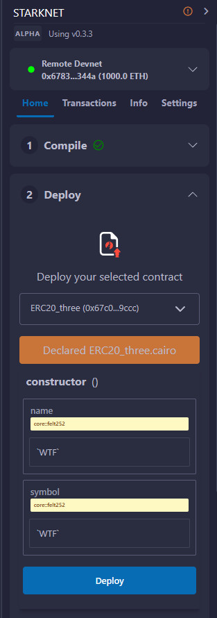
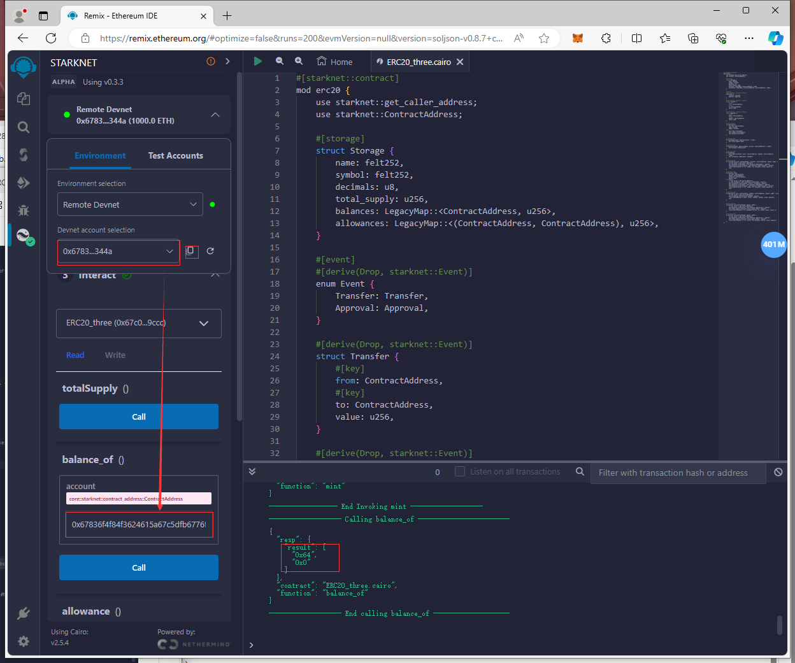

# WTF Cairo极简教程: 28. ERC20

我最近在学`cairo-lang`，巩固一下细节，也写一个`WTF Cairo极简教程`，供小白们使用。教程基于`cairo 2.2.0`版本。

推特：[@0xAA_Science](https://twitter.com/0xAA_Science)｜[@WTFAcademy_](https://twitter.com/WTFAcademy_)

WTF Academy 社群：[Discord](https://discord.gg/5akcruXrsk)｜[微信群](https://docs.google.com/forms/d/e/1FAIpQLSe4KGT8Sh6sJ7hedQRuIYirOoZK_85miz3dw7vA1-YjodgJ-A/viewform?usp=sf_link)｜[官网 wtf.academy](https://wtf.academy)

所有代码和教程开源在 github: [github.com/WTFAcademy/WTF-Cairo](https://github.com/WTFAcademy/WTF-Cairo)

---

之前我们在接口那一讲提到了IERC20，并实现了一个完整的ERC20合约，这一讲，我们将介绍`ERC20`代币标准，精简其中的内容，实现一个最简的ERC20合约，并发行自己的测试代币。

## ERC20

`ERC20`是以太坊上的代币标准，来自2015年11月V神参与的[`EIP20`](https://eips.ethereum.org/EIPS/eip-20)。它实现了代币转账的基本逻辑：

- 账户余额(balanceOf())
- 转账(transfer())
- 授权转账(transferFrom())
- 授权(approve())
- 代币总供给(totalSupply())
- 授权转账额度(allowance())
- 代币信息（可选）：名称(name())，代号(symbol())，小数位数(decimals())

### 事件

`ERC20`有两个事件:`Transfer`事件和`Approval`事件，分别在转账和授权时被释放

```rust
#[event]
#[derive(Drop, PartialEq, starknet::Event)]
enum Event {
    Transfer: Transfer,
    Approval: Approval,
}

#[derive(Drop, PartialEq, starknet::Event)]
struct Transfer {
    #[key]
    from: ContractAddress,
    #[key]
    to: ContractAddress,
    value: u256,
}

#[derive(Drop, PartialEq, starknet::Event)]
struct Approval {
    #[key]
    owner: ContractAddress,
    #[key]
    spender: ContractAddress,
    value: u256,
}
```

### 函数

`IERC20`定义了6个函数，提供了转移代币的基本功能，并允许代币获得批准，以便其他链上第三方使用。

- `totalSupply()`返回代币总供给

    ```rust
    /**
     * @dev 返回代币总供给.
     */
    fn totalSupply(self: @TContractState) -> u256;
    ```

- `balance_of()`返回账户余额
  
    ```rust
    /**
     * @dev 返回账户`account`所持有的代币数.
     */
    fn balance_of(self: @TContractState, account: ContractAddress) -> u256;
    ```

- `allowance()`返回授权额度

    ```rust
    /**
    * @dev 返回`owner`账户授权给`spender`账户的额度，默认为0。
     *
     * 当{approve} 或 {transferFrom} 被调用时，`allowance`会改变.
     */
    fn allowance(self: @TContractState, owner: ContractAddress, spender: ContractAddress) -> u256;
    ```

- `transfer()`转账

    ```rust
    /**
     * @dev 转账 `amount` 单位代币，从调用者账户到另一账户 `to`.
     *
     * 如果成功，返回 `true`.
     *
     * 释放 {Transfer} 事件.
     */
    fn transfer(ref self: TContractState, recipient: ContractAddress, amount: u256) -> bool;
    ```

- `approve()`授权

    ```rust
    /**
     * @dev 调用者账户给`spender`账户授权 `amount`数量代币。
     *
     * 如果成功，返回 `true`.
     *
     * 释放 {Approval} 事件.
     */
    fn approve(ref self: TContractState, spender: ContractAddress, amount: u256) -> bool;
    ```

- `transfer_from()` 授权转账

    ```rust
    /**
     * @dev 通过授权机制，从`from`账户向`to`账户转账`amount`数量代币。转账的部分会从调用者的`allowance`中扣除。
     *
     * 如果成功，返回 `true`.
     *
     * 释放 {Transfer} 事件.
     */
    fn transfer_from(ref self: TContractState, sender: ContractAddress, recipient: ContractAddress, amount: u256) -> bool;
    ```

## 实现ERC20

现在我们写一个简化版的`ERC20`合约。

### IERC20接口

我们需要将上述函数放到接口中：

```rust
use starknet::ContractAddress;

#[starknet::interface]
trait IERC20<TContractState> {
    fn totalSupply(self: @TContractState) -> u256;

    fn balance_of(self: @TContractState, account: ContractAddress) -> u256;

    fn allowance(self: @TContractState, owner: ContractAddress, spender: ContractAddress) -> u256;

    fn transfer(ref self: TContractState, recipient: ContractAddress, amount: u256) -> bool;

    fn approve(ref self: TContractState, spender: ContractAddress, amount: u256) -> bool;

    fn transfer_from(ref self: TContractState, sender: ContractAddress, recipient: ContractAddress, amount: u256) -> bool;
}
```

### 状态变量

我们需要状态变量来记录账户余额，授权额度和代币信息。其中`name`,`symbol`,`decimals`对应代币的名称，代号和小数位数。`total_supply`对应代币的总量，而使用映射类型的`balances`和`allowances`则对应账户余额和授权额度。

```rust
#[storage]
struct Storage {
    name: felt252,
    symbol: felt252,
    decimals: u8,
    total_supply: u256,
    balances: LegacyMap::<ContractAddress, u256>,
    allowances: LegacyMap::<(ContractAddress, ContractAddress), u256>,
}
```

### 函数

导入外部包

```rust
use starknet::get_caller_address;
use starknet::ContractAddress;
```

- 构造函数:初始化代币名称、代号和小数位数。

- `totalSupply()`返回代币总供给

    ```rust
    fn totalSupply(self: @ContractState) -> u256 {
        self.total_supply.read()
    }
    ```

- `balance_of()`返回账户余额

    ```rust
    fn balance_of(self: @ContractState, account: ContractAddress) -> u256 {
        self.balances.read(account)
    }
    ```

- `allowance()`返回授权额度

    ```rust
    fn allowance(
        self: @ContractState, owner: ContractAddress, spender: ContractAddress
    ) -> u256 {
        self.allowances.read((owner, spender))
    }
    ```
  
- `transfer()`函数：实现`IERC20`中的`transfer`函数，代币转账逻辑。调用方扣除`amount`数量代币，接收方增加相应代币。土狗币会魔改这个函数，加入税收、分红、抽奖等逻辑。

    ```rust
    fn transfer(ref self: ContractState, recipient: ContractAddress, amount: u256) -> bool {
        let mut sender = get_caller_address();
        self.balances.write(sender, self.balances.read(sender) - amount);
        self.balances.write(recipient, self.balances.read(recipient) + amount);
        self.emit(Transfer { from: sender, to: recipient, value: amount });
        true
    }
    ```

- `approve()`函数：实现`IERC20`中的`approve`函数，代币授权逻辑。被授权方`spender`可以支配授权方的`amount`数量的代币。

    ```rust
    fn approve(ref self: ContractState, spender: ContractAddress, amount: u256) -> bool {
        let mut caller = get_caller_address();
        self.allowances.write((caller,spender), amount);
        self.emit(Approval { owner: caller, spender: spender, value: amount});
        true
    }
    ```

- `transferFrom()`函数：实现`IERC20`中的`transferFrom`函数，授权转账逻辑。被授权方将授权方`sender`的`amount`数量的代币转账给接收方`recipient`。

    ```rust
    fn transfer_from(
        ref self: ContractState,
        sender: ContractAddress,
        recipient: ContractAddress,
        amount: u256
    ) -> bool {
        let mut caller = get_caller_address();
        let mut allowance = self.allowances.read((sender, caller));
        self.allowances.write((sender, caller), allowance - amount);
        self.balances.write(sender, self.balances.read(sender) - amount);
        self.balances.write(recipient, self.balances.read(recipient) + amount);
        self.emit(Transfer { from: sender, to: recipient, value: amount });
        true
    }
    ```

- `mint()`函数：铸造代币函数，不在`IERC20`标准中。这里为了教程方便，任何人可以铸造任意数量的代币，实际应用中会加权限管理，只有`owner`可以铸造代币：

    ```rust
    fn mint(ref self:ContractState, amount: u256) {
        let mut caller = get_caller_address();
        self.balances.write(caller, self.balances.read(caller) + amount);
        self.total_supply.write(self.total_supply.read() + amount);
        self.emit(Transfer{ from: Zeroable::zero(), to: caller, value: amount });
    }
    ```

- `burn()`函数：销毁代币函数，不在`IERC20`标准中。

    ```rust
    fn burn(ref self:ContractState, amount: u256) {
        let mut caller = get_caller_address();
        self.balances.write(caller, self.balances.read(caller) - amount);
        self.total_supply.write(self.total_supply.read() - amount);
        //self.emit(Transfer { from: caller, to: Zeroable::zero(), value: amount});
    }
    ```

## 发行`ERC20`代币

由于`Remix`上的限制，我们部署不使用接口和事件的ERC20合约(ERC20_NO_INTERFACE_EVENT.cairo)。现在，我们发行属于我们的第一个代币。

在`Remix`上编译并declare`ERC20`合约，在构造函数的参数栏,`name`和`symbol`都设为`WTF`,然后点击`Deploy`键进行部署。



现在，我们创建好了`WTF`代币，接下来，我们要给自己铸造一些代币。点击`Interact`中`Write`，在`mint`那一栏输入要铸造的代币数量，需要注意的是，
`u256`分为高地址和低地址，我们在高地址输入`0`，在低地址输入`100`，并点击`Call`按钮，这样我们就铸造好了`100`个`WTF`代币。


我们通过`read`中的`balance_of()`函数可以查看对应地址的代币余额，输入我们的账户，可以看到余额变为`100`，铸造成功。



## 总结

在这一讲，我们学习了`ERC20`标准及其实现，并发行了我们的测试代币。
